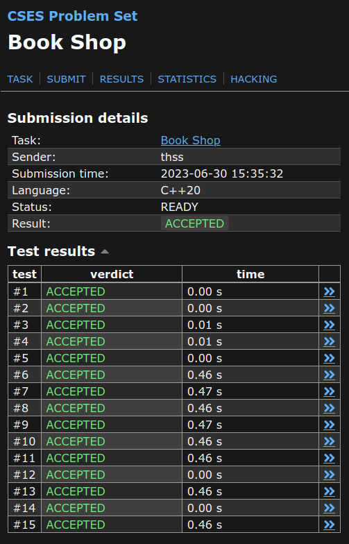
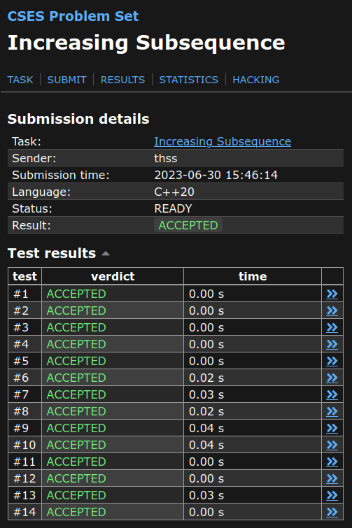
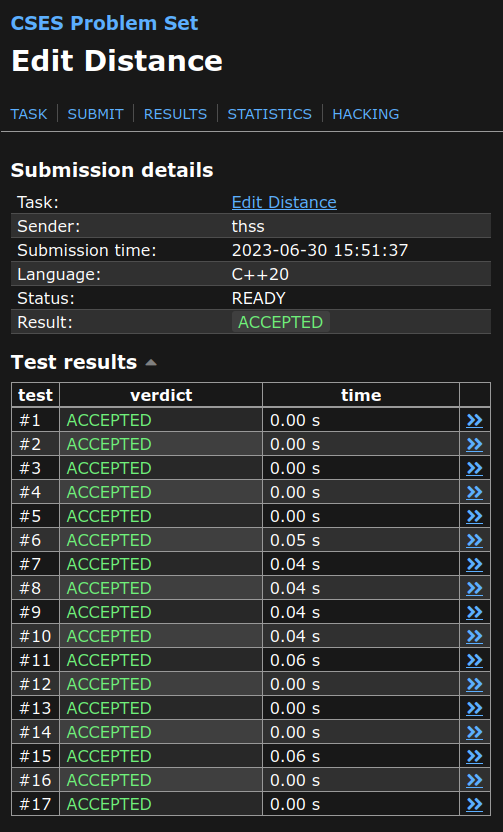
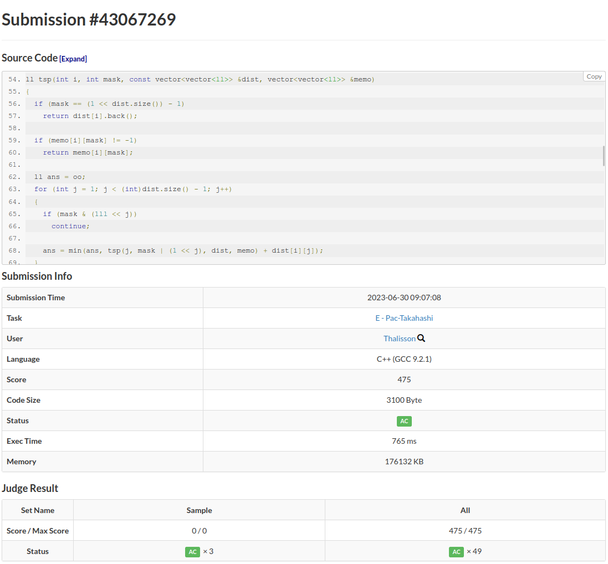

# Programação Dinâmica Exercícios CP

**Número da Lista**: 43 
**Conteúdo da Disciplina**: Programação Dinâmica 

## Alunos
|Matrícula | Aluno |
| -- | -- |
| 19/0117401  |  Thalisson Alves G. de Jesus |

## Sobre
Foram selecionados alguns exercícios que abordam o conteúdo visto no módulo de Programação Dinâmica. Cada exercício possui uma pasta com o seu nome e dentro dela há um arquivo com a solução em C++ e um arquivo explicando o problema e a solução proposta.

## Screenshots

### Exercício 1 - [Book Shop](./Book-Shop/)

### Exercício 2 - [Increasing Subsequence](./Increasing-Subsequence/)

### Exercício 3 - [Edit Distance](./Edit-Distance/)

### Exercício 4 - [Pac-Takahashi](./Pac-Takahashi/)

## Instalação
**Linguagem**: C++ 
**Framework**: (caso exista) 
**Pré-requisitos**: gcc, g++

## Uso

Para submeter as soluções siga os passos abaixo.

1. Entre na página do exercício, um link para ela pode ser encontrado no título `README.md` do exercício desejado.
2. Copie o código `solution.cpp` da mesma pasta que o `README.md`.
3. Submeta o código copiado no juiz online.

## Outros

O vídeo pode ser acessado [aqui](video.mp4).
